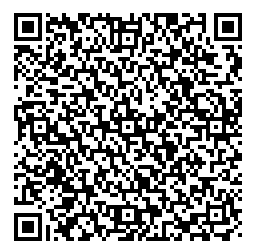

PetN9
==============

Virtual Pet for Qt5

This project is licensed by Dametrious Peyton. All rights reserved. Any code or derivative works requires expressed permission from the author.

<h2>Contribute</h2>

This application is open source,  but please do contribute to active development!

You can contribute in one of two ways:
<ul>
<li>Fork this branch and make pull request! (Please create an issue ticket first, though)
<li>Donate Bitcoins
</ul>

<code>3NeDGutmC7hc5Dv2cUX8YcvPWaUXZm3KAF</code>

 
Copyright ©020 Dametrious Peyton. All Rights Reserved
